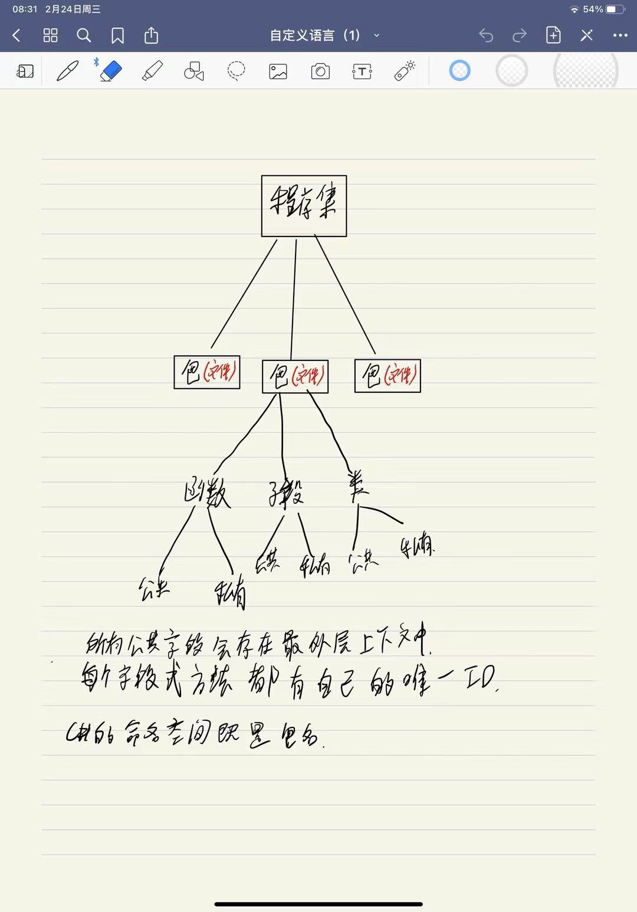
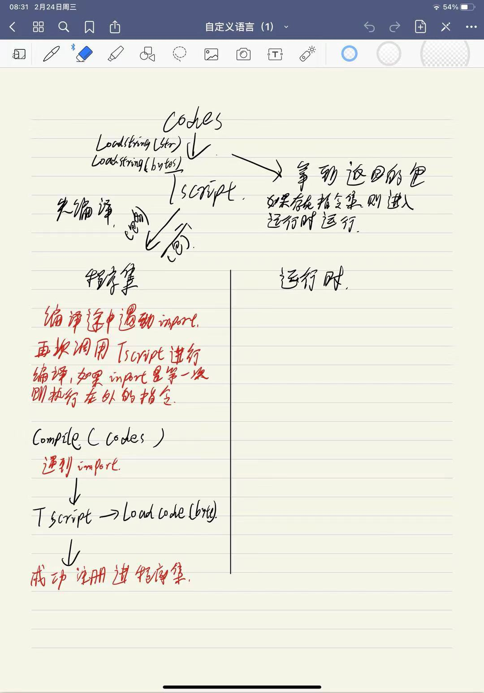
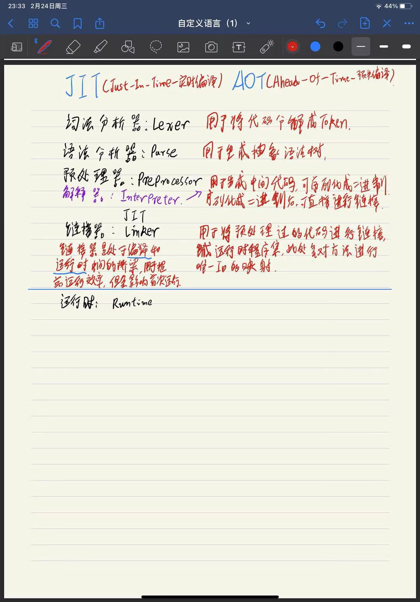

# TScript
## 01 脚本的作用
1.TSLexer.cs 词法分析器,通过输入的文本生成对应的Token

2.TSParse.cs 语法解释器,通过输入的Tokens生成对应的抽象语法树

3.TSCompile.cs 编译器,通过抽象语法树生成对应的OpCode(中间语言)代码

4.TSRuntime.cs 运行时,根据对应的OpCode进行相对应的操作

5.TSContext.cs 上下文,语法执行上下文

